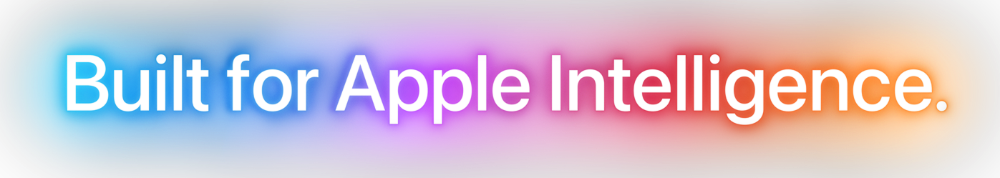
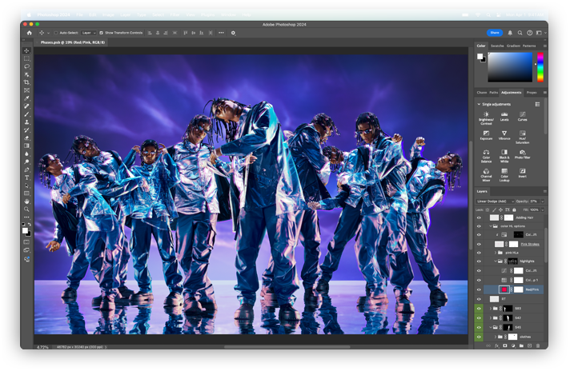
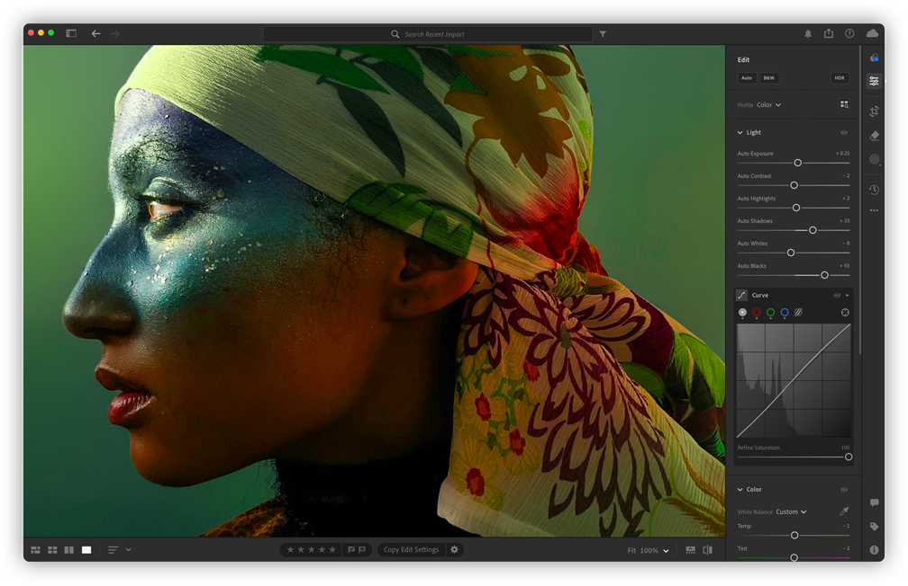
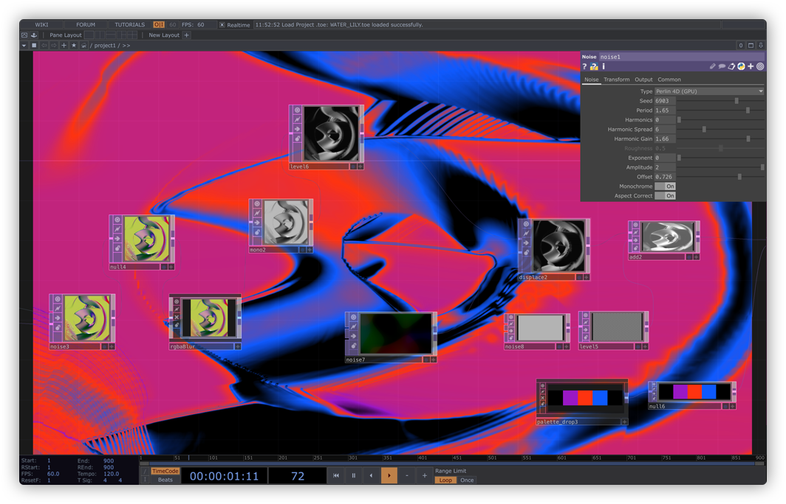

# Apple MacBook Pro Landing Page Clone 🍎💻

A stunning, pixel-perfect clone of the Apple MacBook Pro landing page, built with modern web technologies including React, Three.js, and GSAP. This project demonstrates high-performance animations, interactive 3D models, and a responsive design that mimics the premium feel of Apple's official website.

<div align="center">
  
</div>

## 🚀 Live Demo

<div align="center">
  <h3><a href="https://bhanu2006-24.github.io/Macbook_Landing/">✨ Launch the Live Experience ✨</a></h3>
</div>

## 📸 Visual Showcase

Experience the next level of web graphics and interactivity.

<div align="center">
  
</div>

<br />

<div align="center">
  
  
</div>

## ✨ Key Features

| Feature                    | Description                                                                                                                                 |
| :------------------------- | :------------------------------------------------------------------------------------------------------------------------------------------ |
| **Interactive 3D Models**  |  View the MacBook Pro in a realistic 3D environment using **Three.js** and **React Three Fiber**. |
| **Smooth Animations**      |  Cinematic text reveals and parallax effects powered by **GSAP** and **ScrollTrigger**.    |
| **Dynamic Video Textures** |  3D screens that play video content in sync with your interactions.                        |
| **Responsive Design**      |  Adapts seamlessly to all screen sizes, from large desktops to mobile phones.              |
| **Apple Intelligence**     |  UI components designed to highlight AI capabilities (simulated).                                     |

## 🛠️ Tech Stack

- **Frontend Framework**: [React](https://react.dev/)
- **Build Tool**: [Vite](https://vitejs.dev/)
- **Styling**: [Tailwind CSS v4](https://tailwindcss.com/)
- **Animations**: [GSAP](https://greensock.com/gsap/)
- **3D Ecosystem**: [Three.js](https://threejs.org/), [React Three Fiber](https://docs.pmnd.rs/react-three-fiber/), [Drei](https://github.com/pmndrs/drei)
- **State Management**: [Zustand](https://github.com/pmndrs/zustand)

## ⚙️ Installation & Running Locally

1.  **Clone the repository:**

    ```bash
    git clone https://github.com/bhanu2006-24/Macbook_Landing.git
    cd Macbook_Landing
    ```

2.  **Install dependencies:**

    ```bash
    npm install
    ```

3.  **Run the development server:**

    ```bash
    npm run dev
    ```

4.  **Open in Browser:**
    Navigate to `http://localhost:5173`.

## 📦 Building for Production

```bash
npm run build
```

## 🚀 Deployment

This project is configured for deployment on **GitHub Pages**.

```bash
npm run deploy
```

## 📂 Project Structure

```
Macbook_Landing/
├── public/             # Static assets (3D models, images, videos)
├── src/
│   ├── components/     # Reusable React components
│   ├── constants/      # Static data and configuration
│   ├── store/          # Zustand store for state management
│   ├── App.jsx         # Main application component
│   └── index.css       # Tailwind imports & global styles
└── vite.config.js      # Vite configuration
```

## 🤝 Credits

- **Design Inspiration**: [Apple](https://www.apple.com/macbook-pro/)
- **3D Models**: Community sources (Sketchfab)
- **Project Guide**: JS Mastery

---

<div align="center">
  <i>This is a fan-made educational project and is not affiliated with Apple Inc.</i>
</div>
